## Guidance for building generative AI assistant on AWS.

## Table of Contents

1. [Overview](#overview)
    - [Architecture](#Architecture)
    - [Cost](#cost)
2. [Prerequisites](#prerequisites)
    - [Operating System](#operating-system)
3. [Deployment Steps](#deployment-steps)
4. [Deployment Validation](#deployment-validation)
5. [Running the Guidance](#running-the-guidance)
6. [Next Steps](#next-steps)
7. [Cleanup](#cleanup)

## Overview 

This GenAI assistant is designed to provide a wide range of functionalities to enhance your productivity and knowledge acquisition. It can summarize web pages to give you concise overviews of lengthy articles or reports, saving you time and effort. It offers pdf document insights by extracting key information and providing summaries, making it easier to understand complex documents. The assistant can perform information lookup to fetch relevant data on various topics, helping you find the information you need quickly. Additionally, it provides advice based on your queries, offering guidance on a variety of subjects. For those needing assistance with different languages, it offers language translation services to communicate across linguistic barriers. Overall, this GenAI assistant is a versatile tool to support your research, learning, and communication needs.

### Architecture

 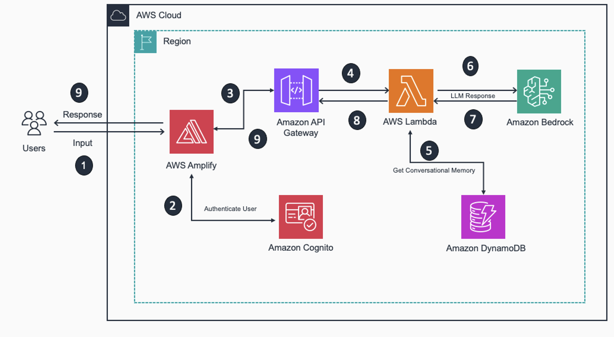

### How It Works

   - When user first access to this GenAI Assistant application, they required to create login using valid email address.
   - Amazon Cognito create and manage user profiles.
   - User interact with application (GenAI Assistant) for chat assistance and/or summarization of web documents, PDFs etc. 
   - At start a user submit messages using front-end application. These user messages can optionally include PDF files.
   - User have choice to select Amazon Bedrock Model - **Amazon Nova Micro** or **Anthropic Claude**. By default, this application uses Amazon Nova Micro model.
   - User messages are sent to Amazon Lambda function via Amazon API Gateway.
   - Amazon Lambda does the backend processing of user input. It analyze the user query and accordingly pull chat history from Amazon DynamoDB table.
   - A LLM chain is created with user chat history and new message. This LLM chain is then submitted to Amazon Bedrock for response generation.
   - Response from Amazon Bedrock is sent back to user and new history is created including the response generated by LLM. 
   - A chat history is maintained per user. Users have option to select their chat histories and delete any of them.


### Cost 

_You are responsible for the cost of the AWS services used while running this Guidance. We recommend creating a [Budget](https://docs.aws.amazon.com/cost-management/latest/userguide/budgets-managing-costs.html) through [AWS Cost Explorer](https://aws.amazon.com/aws-cost-management/aws-cost-explorer/) to help manage costs. Prices are subject to change. For full details, refer to the pricing webpage for each AWS service used in this Guidance._

### Pricing 

| AWS service  | Dimensions | Cost [USD] |
| ----------- | ------------ | ------------ |
| [Amazon Amplify Hosting](https://aws.amazon.com/amplify/pricing/) | Build and deploy| $0.01 per minute|
|               | Data storage| $0.023 per GB per month|
|               | Data transfer out| $0.15 per GB served|
| [Amazon Cognito User - Lite] (https://aws.amazon.com/cognito/pricing/) | Monthly active users (MAUs) | Up to 10k - Free|
| [Amazon Bedrock - Amazon Nova Micro](https://aws.amazon.com/bedrock/pricing/| 1,000,000 input tokens  | $ $0.000035 |
|                                   | 1,000,000 output tokens | $ $0.00014 |
| [Amazon Bedrock - Anthropic Claude 3.5 Sonnet](https://aws.amazon.com/bedrock/pricing/| 1,000,000 input tokens  | $ $0.003 |
|                                   | 1,000,000 output tokens | $ $$0.015 |
| [Amazon API Gateway REST API](https://aws.amazon.com/api-gateway/pricing/) | First 333 million| $ 3.50|
| [Amazon Lambda](https://aws.amazon.com/lambda/pricing) | First 6 Billion GB-seconds / month (x86)  | $0.0000166667 for every GB-second , $0.20 per 1M requests |
| [Amazon DynamoDB](https://aws.amazon.com/dynamodb/pricing/on-demand/) | Data Storage| First 25 GB stored per month - free, $0.25 per GB-month thereafter |
|                                                                        | Write Request Units (WRU)| $0.625 per million write request units |
|                                                                        | Read Request Units (RRU)| $0.125 per million read request units |

## Prerequisites

[Python 3.9](https://www.python.org/) or greater

### AWS account requirements 
-   You must have AWS account to deploy this solution.
-   [Amazon Simple Storage Service(S3) bucket](https://docs.aws.amazon.com/AmazonS3/latest/userguide/create-bucket-overview.html) to stage Lambda function files and Amazon CloudFormation stack.
-   In your AWS account, select your AWS Region and request access for Foundational Models _Amazon Nova Micro_ and _anthropic.claude-3.5-sonnet_ on Amazon Bedrock.

 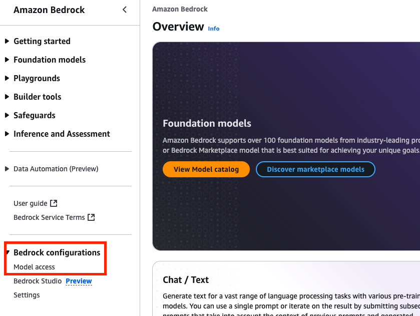
 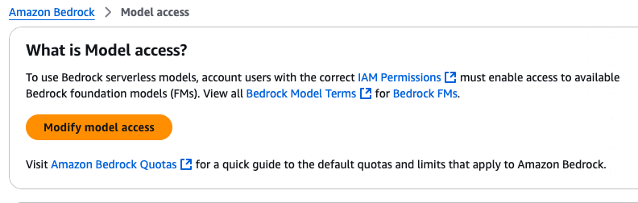
 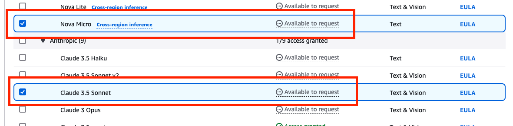
 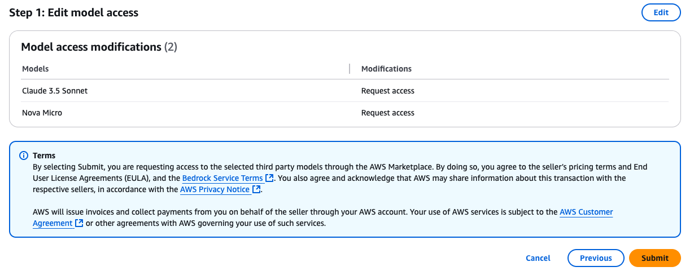


## Deployment Steps


1. You have option to host front-end of this solution locally or on [AWS Amplify](https://aws.amazon.com/amplify/hosting/). [AWS Amplify Hosting](https://aws.amazon.com/amplify/hosting/) enables a fully-managed deployment of the application's React frontend in an AWS-managed account using Amazon S3 and [Amazon CloudFront](https://docs.aws.amazon.com/AmazonCloudFront/latest/DeveloperGuide/Introduction.html).  You can choose this option during Amazon CloudFormation stack deployment.


    **Follow below two steps only to set up Amplify Hosting:**

    -   Fork this GitHub repository and take note of your repository URL, refer (https://docs.github.com/en/pull-requests/collaborating-with-pull-requests/working-with-forks/fork-a-repo).
    -   Create a GitHub fine-grained access token for the new repository by following [this guide](https://docs.aws.amazon.com/amplify/latest/userguide/setting-up-GitHub-access.html). Refer section **Generate a personal access token in your GitHub account**.


2. Download Amazon [Lambda function](src/assets/genai-assistant-lambda-function.zip) and [Amazon Lambda dependencies](src/assets/genai-assistant-backend_layer.zip) and upload to your Amazon S3 bucket in same AWS Region where you will deploy this solution.
3. Download AWS CloudFormation template [guidance-for-genai-assistant.yaml](guidance-for-genai-assistant.yaml) from the GitHub repository to your local system. Update your Amazon S3 bucket name for Amazon Lambda function code and Lambda Layer.

   ```json
   S3Bucket: <YOUR AMAZON S3 BUCKET NAME> 
   ```

4. Deploy updated CloudFormation template to deploy the solution.

 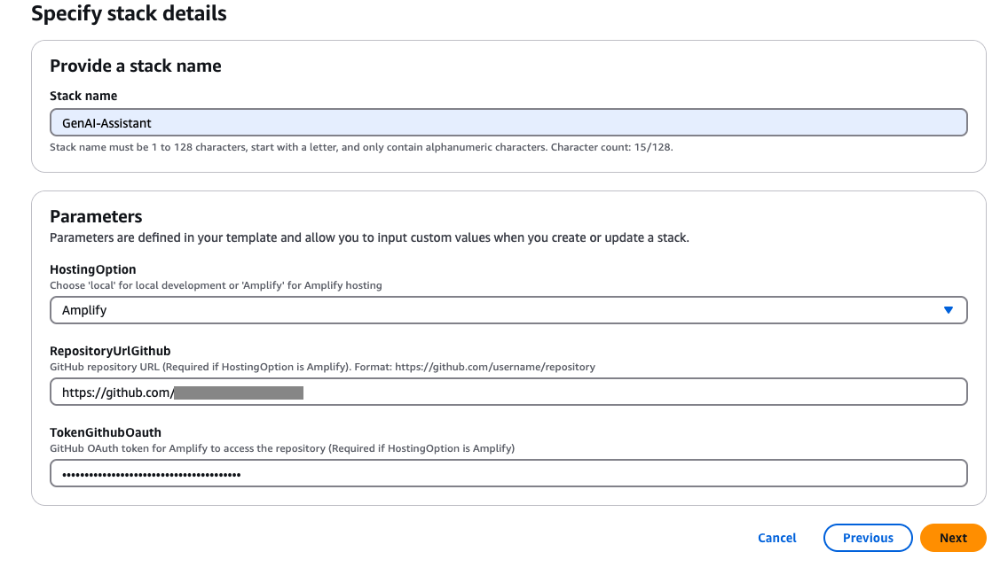


## Deployment Validation 

1. Open CloudFormation console and verify the status of the CloudFormation stack. It should have CREATE_COMPLETE status. 

2. Navigate to output tab and review deployed resources

 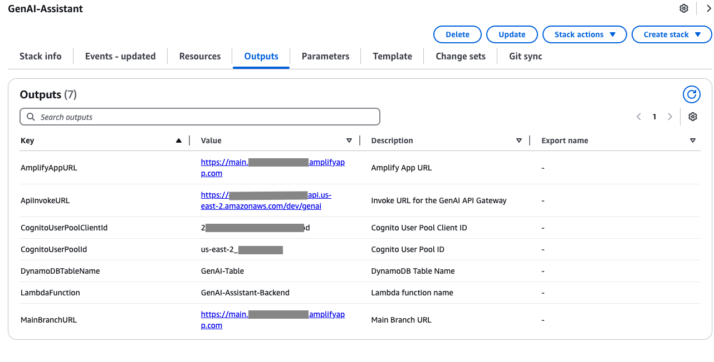


3. If you selected to deploy the frontend using Amazon Amplify Hosting, navigate to the Amplify console to check the build status. 

 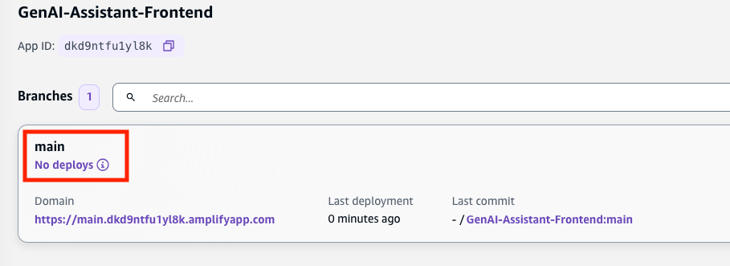

If the build does not start automatically, trigger it through the Amplify console.

 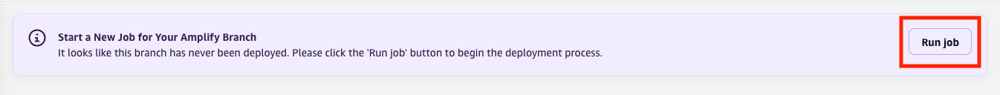

4. Validate environment variables setup for the Amplify App hosting

 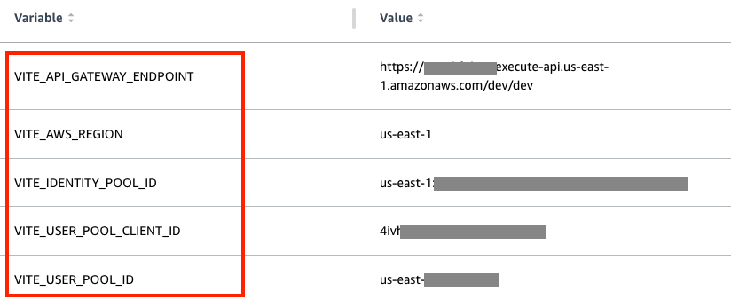


5. If you selected to run the frontend locally and connect to the deployed resources in AWS, use the CloudFormation stack outputs to verify deployed resources.


## Running the Guidance 


### Running with Amazon Amplify hosting

1. In the [AWS Console](https://aws.amazon.com/console/), navigate to  Amazon CloudFormation  and select CloudFormation stack deployed as part of this guidance. Navigate to 'output' tab.
 
2. Click on Amplify App URL to access the deployed solution. For the first time user, switch to 'Create Account' tab and follow the instructions to create new user account.
 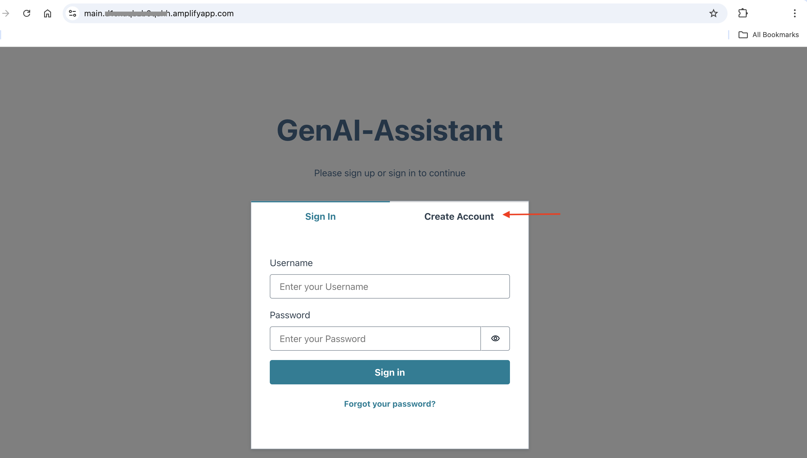

3. After successful login, you will be presented to the main page of GenAI Assistant.
 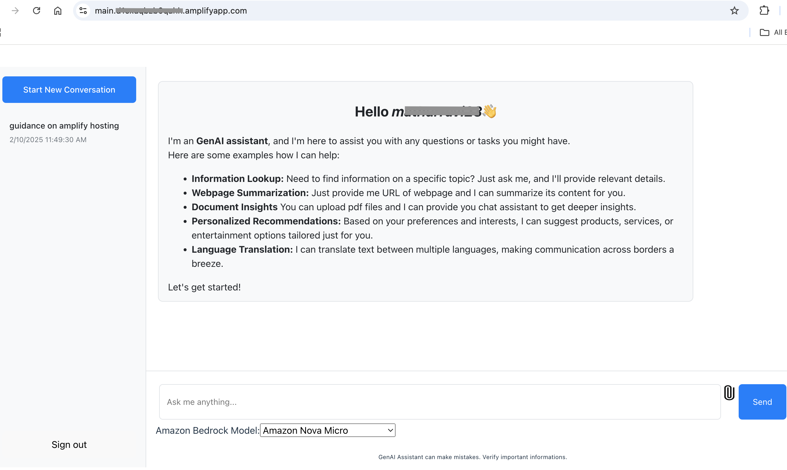


### Running locally

1. Clone this repository to your local machine where you will run the solution:


```bash
git clone https://github.com/aws-samples/guidance-for-genai-assistant.git
```

2. Navigate to the solution directory

```bash
cd guidance-for-genai-assistant
```

3. Create a file named `.env`. [Vite will use this file](https://vitejs.dev/guide/env-and-mode.html) to set up environment variables when we run the application locally.

Copy the following file content and replace the values with the outputs provided in AWS CloudFormation deployment:

```plaintext
VITE_IDENTITY_POOL_ID="us-east-1:xxxx"
VITE_AWS_REGION="us-east-1"
VITE_USER_POOL_ID="us-east-1_xxxx"
VITE_USER_POOL_CLIENT_ID="xxxxxx"
VITE_API_GATEWAY_ENDPOINT="https://xxxx.execute-api.us-east-1.amazonaws.com/dev/dev"
```

4. Next, install the dependencies by running the following command:

```bash
npm ci
```

5. Finally, to start the application locally, run the following command:

```bash
npm run dev
```

Vite will now start the application under `http://localhost:8080`. You can modify the port by updating [Vite configuration file](vite.config.js).


## Next Steps

In this guide we are using Amazon Bedrock with foundational models _Amazon Nova Micro_ and _Anthropic Claude 3.5 Sonnet_. You can build on top of this solution and make it more customized for your requirements. Also try [other models available on Amazon Bedrock](https://docs.aws.amazon.com/bedrock/latest/userguide/models-supported.html) and review [AWS solution library](https://aws.amazon.com/solutions/) for more focused solutions.


## Cleanup

When no longer needed, you can delete the resources manually or by deleting the entire AWS CloudFormation stack.

- If you want to delete the entire stack using the CloudFormation console:
    - Sign in to the AWS CloudFormation console
    - Select the Stack GenAI-Assistant and click on delete.

- Delete Amazon Lambda files uploaded on your Amazon S3 bucket.

## Notices

Customers are responsible for making their own independent assessment of the information in this Guidance. This Guidance: (a) is for informational purposes only, (b) represents AWS current product offerings and practices, which are subject to change without notice, and (c) does not create any commitments or assurances from AWS and its affiliates, suppliers or licensors. AWS products or services are provided “as is” without warranties, representations, or conditions of any kind, whether express or implied. AWS responsibilities and liabilities to its customers are controlled by AWS agreements, and this Guidance is not part of, nor does it modify, any agreement between AWS and its customers._

## License
This library is licensed under the MIT-0 License. See the LICENSE file.

## Author

- Ravi Mathur

## Contribution

This repository is intended for educational purposes and does not accept further contributions. Feel free to utilize and enhance the app based on your own requirements.